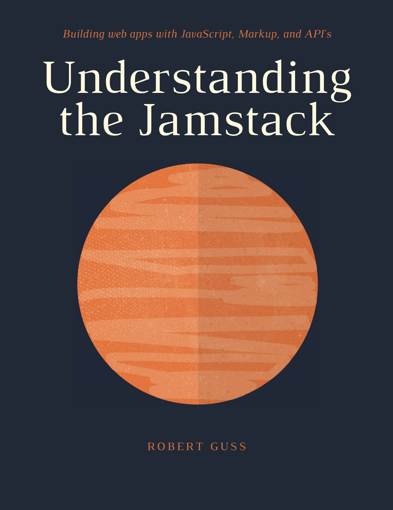

# Welcome {-} 

I wrote "Understanding the Jamstack" in order to help developers get a better understanding of the Jamstack
architecture/philosophy and its ecosystem. There are lots of tutorials, blog posts, articles, YouTube videos, etc. that
provide information about the Jamstack, but I have yet to find a single resource that attempts to explain it all. This
book is my attempt at being that single resource.

Not only will you learn what the Jamstack is, but you will also build a few projects to help you gain a better
understanding of what is possible with this architecture. You will also learn and be exposed to lots of various tools,
technologies and services in the ecosystem. 

Each project intentionally uses different tooling so as to give you as much experience with as many tools as possible.
However, this means that I am not able to go into great detail about each tool and service. My intention is to give you
enough information and experience to help you find what you like and where you can go to learn more.

This book is not intended for beginners. I assume you have at least an basic to intermediate level of understanding of HTML, CSS and JavaScript. 

Finally, I would like to personally thank you for taking the time to read this book as I have put in many hours creating
it. It has been a labor of love and a passion of mine. I hope it will serve you well.

I would love to hear any feedback, corrections, criticism, etc. You can find me on Twitter
[here](https://twitter.com/_howtocode_). You can reach me via email at <a href="mailto:howtocode@pm.me">howtocode@pm.me</a>

Cheers,
Robert Guss