# Ecommerce with Gatsby & Stripe Checkout

In this project we are going to be creating a simple e-commerce web site with Gatbsy and Stripe checkout. Stripe checkout is client-side checkout that allows us to integrate a complete checkout experience without a backend.

## Installing Gatsby

First you will need to download and install [Gatsby](https://www.gatsbyjs.com)

```bash
npm i -g gatsby-cli
```

With the cli installed, create a new project.

```bash
gatsby new stripe-checkout
# name the project whatever you would like
```

Open up the project and run the development server.

```bash
gatsby develop
```

One the server is up and running you should be able to preview the site at `http://localhost:8000/`.

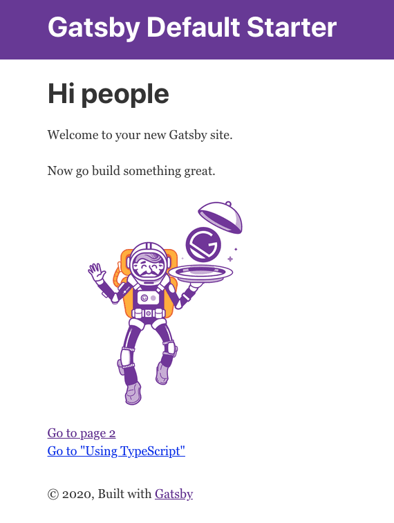

## Installing & Configuring Stripe

You will need to create a [Stripe](https://stripe.com/) account if you don't already have one. You can sign up for a free account as it will provide all that we need for our project.

Once you have your Stripe account setup, head back over to your terminal to install the Stripe NPM packages.

```bash
npm install @stripe/stripe-js gatsby-source-stripe
```

With both of these packages installed, we now need to add the `gatsby-sourcce-stripe` plugin to our `gatsby-config.js` file. Add the following to the config.

```js
{
resolve: `gatsby-source-stripe`,
options: {
  objects: ["Price"],
  secretKey: 'secret key goes here',
  downloadFiles: false,
},
```

You will notice that there is a key called `secretKey` which we need to populate with our secret key from stripe. We will configure this next.

The entire file should look like this.

```js
module.exports = {
  siteMetadata: {
    title: `Gatsby Default Starter`,
    description: `Gatsby Default Starter`,
    author: `@gatsbyjs`,
  },
  plugins: [
    `gatsby-plugin-react-helmet`,
    {
      resolve: `gatsby-source-filesystem`,
      options: {
        name: `images`,
        path: `${__dirname}/src/images`,
      },
    },
    `gatsby-transformer-sharp`,
    `gatsby-plugin-sharp`,
    {
      resolve: `gatsby-plugin-manifest`,
      options: {
        name: `gatsby-starter-default`,
        short_name: `starter`,
        start_url: `/`,
        background_color: `#663399`,
        theme_color: `#663399`,
        display: `minimal-ui`,
        icon: `src/images/gatsby-icon.png`,
      },
    },
    {
      resolve: `gatsby-source-stripe`,
      options: {
        objects: ['Price'],
        secretKey: 'secret key goes here',
        downloadFiles: false,
      },
    },
  ],
};
```

Head back over to the Stripe dashboard and click on "Developers" and then "API keys" on the left hand side.

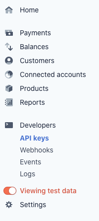

_**make sure to toggle on the "Viewing test data" as well.**_

In the "Standard keys" section you should see the following.

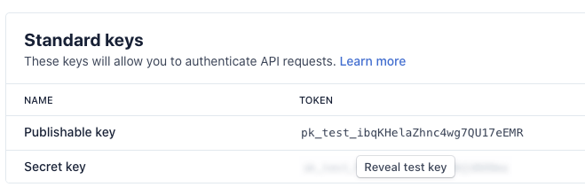

Click the "Reveal live key" to show your secret key and then copy it.

### Creating .env variables

We obviously do not want to simply paste our secret key into our gatsby config, because then it would be exposed to the outside world. This is a huge security risk! So in order for us to protect our keys, we are going to create a `.env` file. This will allow us to use our keys without exposing them to the public.

In the root of our gatsby project create two files called `.env.development` & `.env.production`

```bash
touch .env.development
touch .env.production
```

Within both files add both your `Publishable` and `Secret` keys like so:

```bash
GATSBY_STRIPE_SECRET=sk_test_FOlN...
GATSBY_STRIPE_PUBLISHABLE=pk_test_ibqK...
```

the `GATSBY` prefix is important because we need these variables exposed to the client. You can read more about this [here](https://www.gatsbyjs.com/docs/how-to/local-development/environment-variables/#example-of-using-an-environment-variable)

`.env.production` will contain the keys we need for production, for the sake of
this example our keys will be the same, but in a real world project they would be different. We also need to specify different variables for different environments for when we build our project to deploy on Vercel.

Now let's add this file to `.gitignore` so we will not accidentally check it into our version control.

```bash
# dotenv environment variable files
.env*
```

_**This may already exist from when we first created our project, but double check just in case.**_

Now we need to use these env variables in our Gatsby config.

```js
{
  resolve: `gatsby-source-stripe`,
  options: {
    objects: ['Price'],
    secretKey: process.env.GATSBY_STRIPE_SECRET,
    downloadFiles: false,
  },
},
```

We also need to include our `.env.development` file in our config so that we have access to the variables. Add the following snippet to the top of the `gatsby-config.js` file just above the `module.exports = {`

```js
require("dotenv").config({
  path: `.env.${process.env.NODE_ENV}`,
})

module.exports = {
```

### Stripe Checkout

Now let's setup and configure Stripe checkout. Head over to `https://dashboard.stripe.com/settings/checkout`. Under the
"Next steps" section, click the "Enable client-only integration" button.

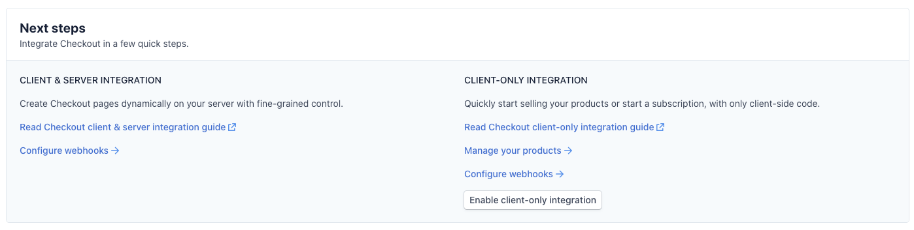

Click "Allow" on the modal that pops up.

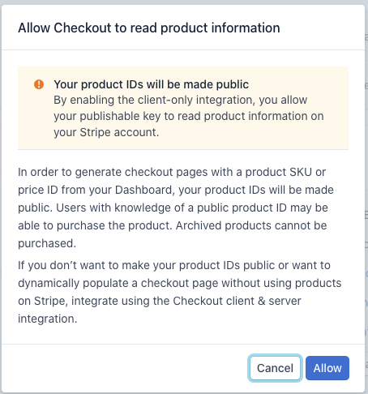

You should now see some additional fields in the "Next steps" section.

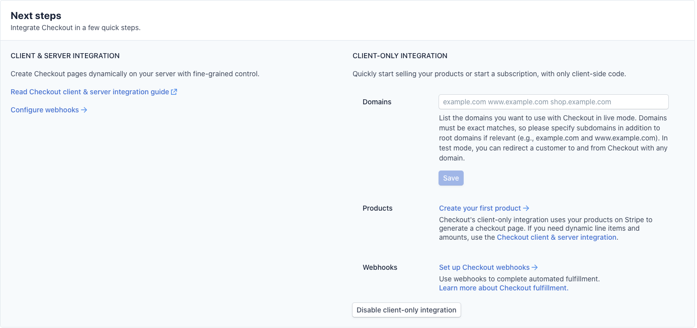

Next we need to create some products in Stripe to sell on our site. Click on the "Create your first product" link.

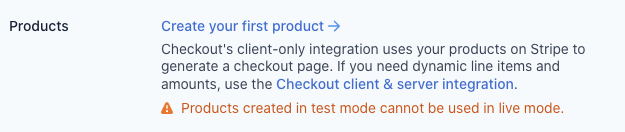

On the next screen click on the "Add Product" button to add our first product.

For this example store we are going to be selling t-shirts for developers. So let's find some images of dev t-shirt's that we can sell. You are free to use whatever images or products you would like. I am going to use some images I found from [Redbubble](https://www.redbubble.com/shop/dev+t-shirts)

Enter a name for the product, upload the image, set the price and check the "one-time" button.

_**Make sure to add a few products at least, just so we have some actual products to populate our store page with.**_

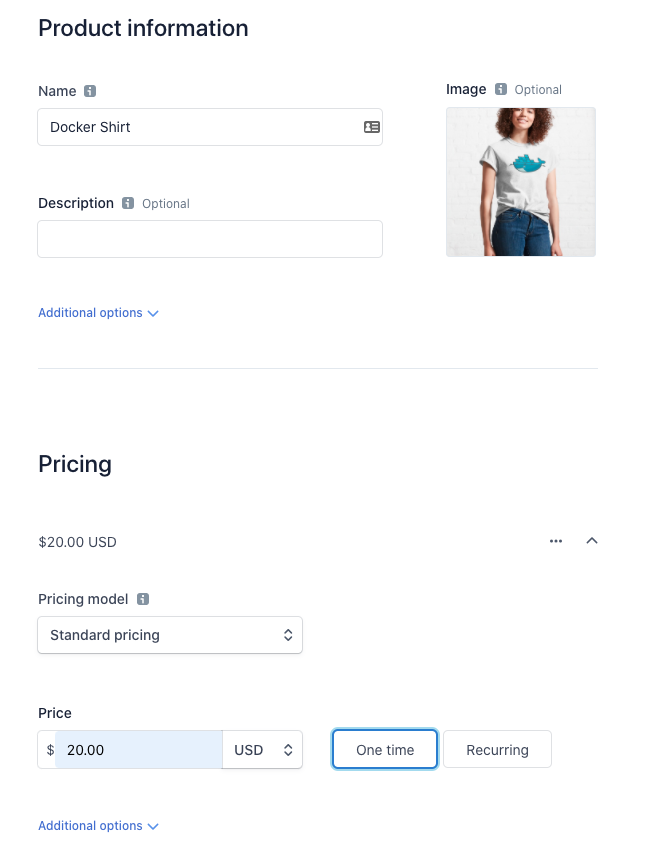

## Adding stripe as a utility function

Per Gatsby's [docs](https://www.gatsbyjs.com/tutorial/ecommerce-tutorial/#extract-loading-of-stripejs-into-a-utility-function) they recommend that we wrap `Stripe.js` into a utility function so that we can use it across multiple pages.

Create a new file in `src/utils/stripejs.js` and add the following.

_**you will need to create the `utils` folder as well**_

```js
import { loadStripe } from '@stripe/stripe-js';

let stripePromise;
const getStripe = () => {
  if (!stripePromise) {
    stripePromise = loadStripe(process.env.GATSBY_STRIPE_PUBLISHABLE);
  }
  return stripePromise;
};

export default getStripe;
```

## Adding a shopping cart

We are going to be installing a shopping cart package that will allow our customers to add t-shirts to their cart, as this does not come out of the box with Stripe checkout. Otherwise customers will only be able to buy a single product at a time.

We will be installing [Use-Shopping-Cart](https://useshoppingcart.com/getting-started#installation)

Install the shopping cart with the following command.

```bash
npm install --S use-shopping-cart
```

## Displaying our products

Now that we have some products uploaded to Stripe, and your shopping cart installed, we need to display them on our Gatsby site.

### Index Page

Withing `/pages/index.js` add the following.

```js
import React from 'react';

import Layout from '../components/layout';
import SEO from '../components/seo';

import Products from '../components/Products/Products';
import CartOverview from '../components/CartOverview';

import { loadStripe } from '@stripe/stripe-js';
import { CartProvider } from 'use-shopping-cart';

const stripePromise = loadStripe(process.env.GATSBY_STRIPE_PUBLISHABLE);

const url = typeof window !== 'undefined' ? window.location.origin : null;

const CartExample = () => (
  <Layout>
    <SEO title="Dev Shirts" />
    <CartProvider
      mode="client-only"
      stripe={stripePromise}
      successUrl={`${url}/page-2/`}
      cancelUrl={`${url}/`}
      currency="USD"
      allowedCountries={['US', 'GB', 'CA']}
      billingAddressCollection={true}
    >
      <CartOverview />
      <Products />
    </CartProvider>
  </Layout>
);

export default CartExample;
```

### Products Component

Create a new folder called `Products` inside of the `src/components folder` and create a file called `Products.js`.

```js
// src/components/Products/Products.js

import React from 'react';
import { graphql, StaticQuery } from 'gatsby';
import ProductCard from './ProductCard';

const conatinerStyles = {
  display: 'flex',
  flexDirection: 'row',
  flexWrap: 'wrap',
  justifyContent: 'space-between',
  padding: '1rem 0 1rem 0',
};

export default (props) => (
  <StaticQuery
    query={graphql`
      query ProductPrices {
        prices: allStripePrice(
          filter: { active: { eq: true }, currency: { eq: "usd" } }
          sort: { fields: [unit_amount] }
        ) {
          edges {
            node {
              id
              active
              currency
              unit_amount
              product {
                id
                name
                images
              }
            }
          }
        }
      }
    `}
    render={({ prices }) => (
      <div style={conatinerStyles}>
        {prices.edges.map(({ node: price }) => {
          const newProduct = {
            sku: price.id,
            name: price.product.name,
            price: price.unit_amount,
            currency: price.currency,
            image: price.product.images,
          };
          return <ProductCard key={price.id} product={newProduct} />;
        })}
      </div>
    )}
  />
);
```

### Product Card Component

Create a new file called `ProductCard.js` in the `src/components/Products` folder.

```js
// src/components/Products/ProductCard.js
import React from 'react';

import { useShoppingCart, formatCurrencyString } from 'use-shopping-cart';

const cardStyles = {
  display: 'flex',
  flexDirection: 'column',
  justifyContent: 'space-around',
  alignItems: 'flex-start',
  padding: '1rem',
  marginBottom: '1rem',
  boxShadow: '5px 5px 25px 0 rgba(46,61,73,.2)',
  backgroundColor: '#fff',
  borderRadius: '6px',
  maxWidth: '300px',
};
const buttonStyles = {
  fontSize: '13px',
  textAlign: 'center',
  color: '#fff',
  outline: 'none',
  padding: '12px',
  boxShadow: '2px 5px 10px rgba(0,0,0,.1)',
  backgroundColor: 'rgb(255, 178, 56)',
  borderRadius: '6px',
  letterSpacing: '1.5px',
};

const ProductCard = ({ product }) => {
  const { addItem } = useShoppingCart();

  return (
    <div style={cardStyles}>
      
      <h4>{product.name}</h4>
      <p>
        Price:{' '}
        {formatCurrencyString({
          value: parseInt(product.price),
          currency: product.currency,
        })}
      </p>
      <button style={buttonStyles} onClick={() => addItem(product)}>
        ADD TO CART
      </button>
    </div>
  );
};

export default ProductCard;
```

### Shopping Cart Component

Lastly, we will create a component for our shopping cart.

```js
// src/components/CartOverview.js

import React, { useState } from 'react';

import { useShoppingCart } from 'use-shopping-cart';

const buttonStyles = {
  fontSize: '13px',
  textAlign: 'center',
  color: '#fff',
  outline: 'none',
  padding: '12px',
  boxShadow: '2px 5px 10px rgba(0,0,0,.1)',
  backgroundColor: 'rgb(255, 178, 56)',
  borderRadius: '6px',
  letterSpacing: '1.5px',
};

const Cart = () => {
  const [loading, setLoading] = useState(false);
  /* Gets the totalPrice and a method for redirecting to stripe */
  const {
    formattedTotalPrice,
    redirectToCheckout,
    cartCount,
    clearCart,
  } = useShoppingCart();

  return (
    <div>
      {/* This is where we'll render our cart */}
      <p>Number of Items: {cartCount}</p>
      <p>Total: {formattedTotalPrice}</p>

      {/* Redirects the user to Stripe */}
      <button
        style={buttonStyles}
        disabled={loading}
        onClick={() => {
          setLoading(true);
          redirectToCheckout();
        }}
      >
        {loading ? 'Loading...' : 'Checkout'}
      </button>
      <button style={buttonStyles} onClick={clearCart}>
        Clear cart
      </button>
    </div>
  );
};

export default Cart;
```

Our site should now look like this.

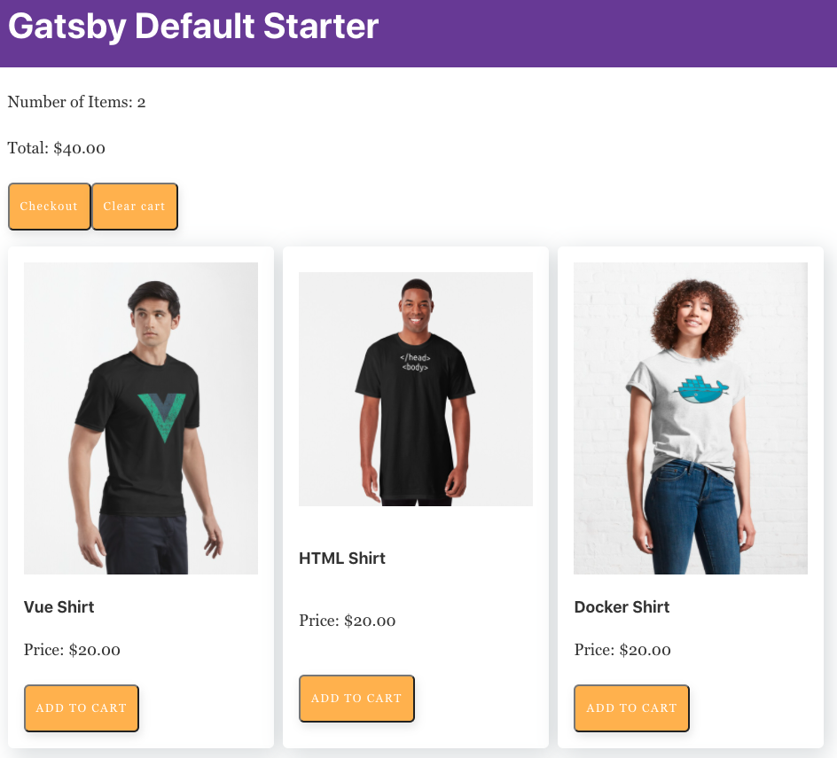

Add a couple of products to the cart and then click "Checkout"

If everything goes well you should be presented with the Stripe checkout.

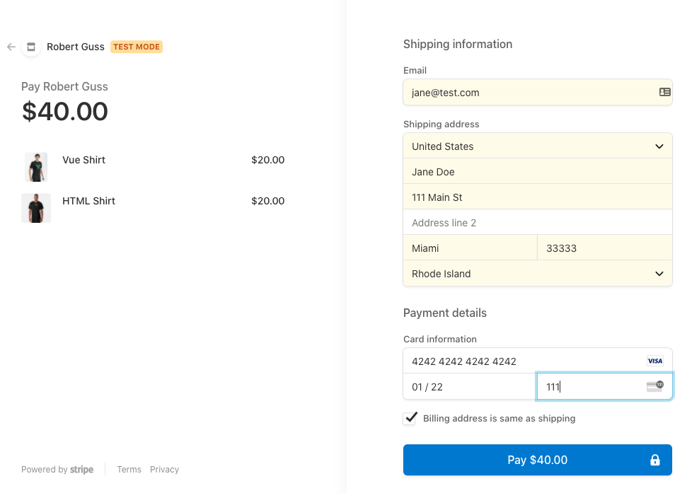

Fill out the details and use the special Stripe credit card `4242 4242 4242 4242`. For the expiration date choose any date that is in the future and use any 3 digit number for the security code.

Now if you open up your Stripe dashboard and click on "Payments" in the left sidebar you should see the purchase you just made.

_**remember to make sure the "Viewing test data" is toggled on in the left sidebar**_

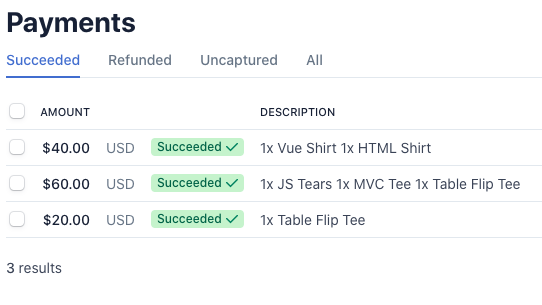

## Deploying to Vercel

We are going to be deploying our site to [Vercel](https://vercel.com/dashboard) another very popular hosting provider for Jamstack sites. Head over there and sign up for a free account.

Before we can use Vercel we first need to push our Gatsby site up to GitHub.

_**If you forget how to do this, please take a look back at the Hugo Blog project where I show you how to set this up.**_

Once you are logged into Vercel you should be taken to your dashboard.

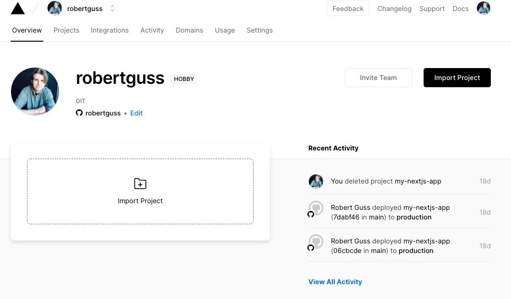

Click on "Import project" and then "Import Git Repository"

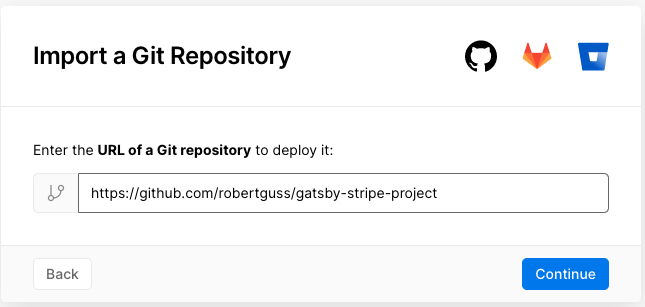

You then need to paste in the url of your repo from GitHub and press "Continue"

Vercel is smart enough to detect that this is a Gatsby project and so the "Build and Output Settings" are already configured for us. However we do need to paste in our `.env` variables in the "Environment Variables" section.

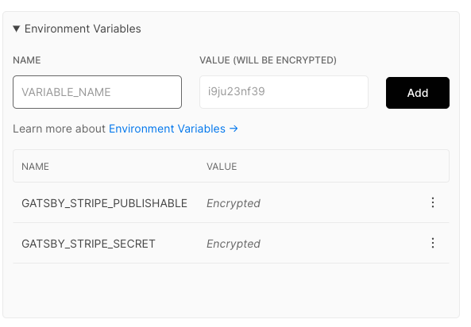

Then press the "Deploy" button.

After a couple mins or so you should see the following if your site was deployed successfully.

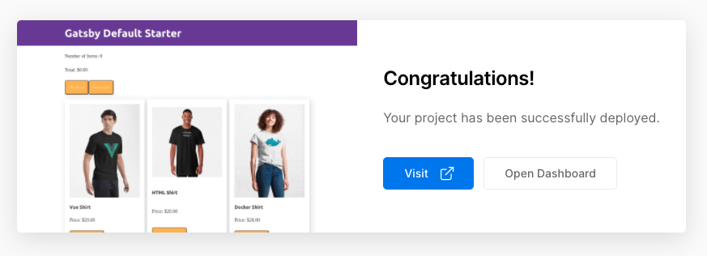

Click the "Visit" button to see the live site.

Try and make a test purchase and confirm the purchase is displayed in your Stripe dashboard.

## GitHub Repo
The completed project can be found here inside of `Gatsby-eCommerce/final` 
[GitHub Repo](https://github.com/robertguss/howtocode-understanding-the-jamstack)

## Wrap Up

In this tutorial we learned how to create an ecommerce site using Gatsby and Stripe Checkout. We also installed a shopping cart plugin and deployed our site to Vercel.